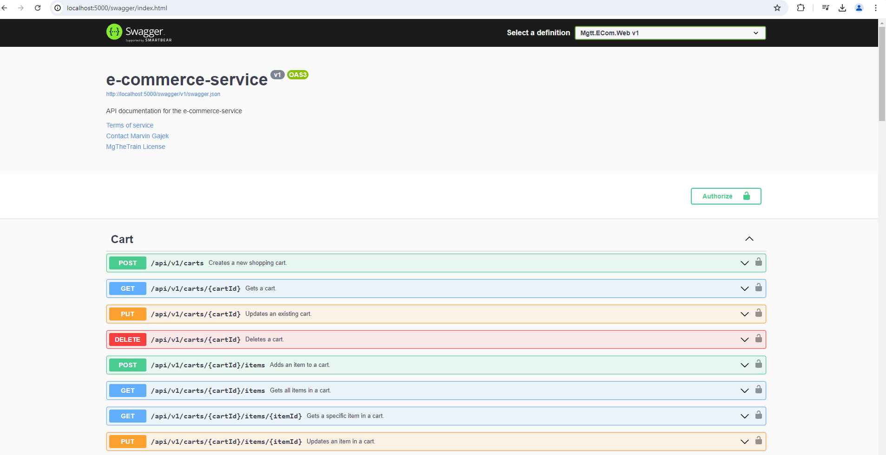

# e-commerce-service


## Table of Contents

- [Summary](#summary)
- [Features](#features)
- [Getting Started](#getting-started)
- [Documentation](#documentation)

## Summary

Web front- and backend for an e-commerce platform utilizing DDD principles based on an [existing cookiecutter template](https://github.com/MGTheTrain/dotnet-ddd-web-api-starter) for [the web backend](./backend/Mgtt.ECom/)

## Features

- **User Management**
  - User Registration & Authentication
    - [x] Securely handle user sign-up, login, and role management.
    - [x] Communicate with IAM provider APIs like Auth0.
    - [ ] Configuring authorization URLs with Auth0 as the central IAM system for external IdPs (e.g. Apple, Microsoft, Google).

- **Product Management**
  - Product Catalog
    - [x] Create, read, update, and delete (CRUD) operations for products.

- **Order Management**
  - Order Processing
    - [x] Manage customer orders from creation to completion.
    - [x] Incorporate payment APIs like PayPal or Stripe
  - Order Items
    - [x] Handle individual items within an order, including quantity and price details.

- **Shopping Cart**
  - Cart Functionality
    - [x] Allow users to add products to their cart, view cart contents and update quantities.
  - Cart Persistence
    - [x] Ensure cart contents persist across user sessions.

- **Review Management**
  - Product Reviews
    - [x] Enable users to write reviews for products, rate them and provide feedback.
  - Review Moderation
    - [ ] Manage and moderate user reviews to maintain quality and trustworthiness. Therefore leverage OpenAI APIs.

- [ ] Reduce the number of web backend calls from the web frontend by providing HTTP endpoints that perform multiple logical backend operations
- [ ] Decouple the monolith into µServices
- [ ] Implement filtering and pagination for specific list calls in web backend
- [ ] Increase and measure code coverage
- [ ] Enable the uploading and resizing of product images

**NOTE:** Also consider checking out the [entity relationship diagram](./docs/diagrams/entity-relationship-diagram.mmd)

## Getting Started

### Preconditions

- [Install Docker Engine](https://docs.docker.com/engine/install/)
- Auth0 instance and expertise in creating necessary resources (roles, permissions, applications, APIs). **TBD:** Deployment of Auth0 resources using Terraform  required by web backend and web frontend

### Backend

You can find instructions on applicable commands for the backend source code in the following [README.md](./backend/Mgtt.ECom/README.md)

### Frontend

You can find instructions on applicable commands for the frontend source code in the following [README.md](./frontend/e-commerce-service/README.md)

### Local docker compose setup

**Precondition**: Update the values in [Mgtt.ECom.Web.env](./Mgtt.ECom.Web.env) and [environment.ts](./frontend/e-commerce-service/environments/environment.ts)

You can start the web front-end and back-end using the command:

```sh
docker-compose up -d --build # Optionally run this command twice if internal services are not yet up and running
``` 

To view the web backend, open a browser and go to `localhost:5000/swagger/index.html`. Results should resemble:



To view the web frontend, open a browser and go to `localhost:4200`. Results should resemble:

**TBD**

You can remove all Docker resources with:

```sh
docker-compose down -v
```

## Documentation

Explore the Web API structure [here](./docs/api-design/web-api-structure.md). For more details on the use case overview [checkout following diagram](./docs/diagrams/use-case-overview.mmd). For more details on user roles and permissions required for RBAC [checkout following diagram](./docs/diagrams/user-roles-and-permissions-mapping.mmd).

Optionally copy contents of the [swagger.json](./docs/api-design/swagger.json) to the [Swagger Online editor](https://editor.swagger.io/) and access the Swagger UI.