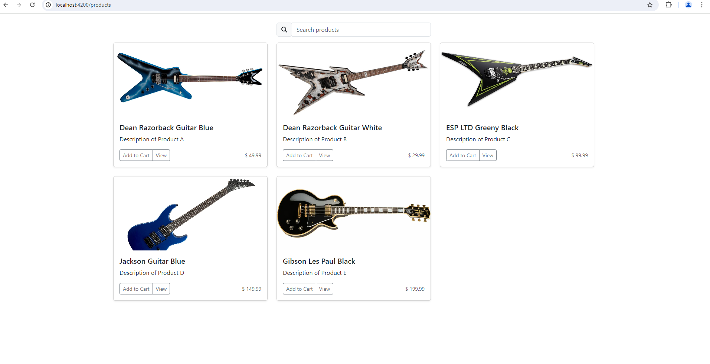

# e-commerce-service

## Table of Contents

- [Summary](#summary)
- [Features](#features)
- [API Structure](#api-structure)
- [Getting Started](#getting-started)

## Summary

Web front- and backend for an e-commerce platform utilizing DDD principles based on an [existing cookiecutter template](https://github.com/MGTheTrain/dotnet-ddd-web-api-starter) for [the web backend](./backend/Mgtt.ECom/)

## Features

| **Domain**             | **Feature**                                | **Description**                                                             |
|------------------------|--------------------------------------------|-----------------------------------------------------------------------------|
| **User Management**    | User Registration & Authentication         | Securely handle user sign-up, login, and role management.                   |
|                        | User Profile Management                    | Manage user details such as username, email, and password.                  |
| **Product Management** | Product Catalog                            | Create, read, update, and delete (CRUD) operations for products.            |
|                        | Category Management                        | Organize products into categories for easier navigation and searchability.  |
| **Order Management**   | Order Processing                           | Manage customer orders from creation to completion.                         |
|                        | Order Items                                | Handle individual items within an order, including quantity and price details. |
| **Shopping Cart**      | Cart Functionality                         | Allow users to add products to their cart, view cart contents, and update quantities. |
|                        | Cart Persistence                           | Ensure cart contents persist across user sessions.                          |
| **Review Management**  | Product Reviews                            | Enable users to write reviews for products, rate them, and provide feedback. |
|                        | Review Moderation                          | Manage and moderate user reviews to maintain quality and trustworthiness.   |

**NOTE:** Also consider checking out the [entity relationship diagram](./docs/diagrams/entity-relationship-diagram.mmd)

## Web API Structure

Explore different versions of the Web API architecture [here](./docs/api-design/web-api-structure/).

Copy contents of the [swagger.json](./docs/api-design/swagger.json) to the [Swagger Online editor](https://editor.swagger.io/).
Results should resemble following snippet:


## Getting Started

### Preconditions

- [Install Docker Engine](https://docs.docker.com/engine/install/)

### Backend

You can find instructions on applicable commands for the backend source code in the following [README.md](./backend/Mgtt.ECom/README.md)

### Frontend

You can find instructions on applicable commands for the frontend source code in the following [README.md](./frontend/e-commerce-service/README.md)

### Local docker compose setup

You can start the web front-end and back-end using the command:

```sh
docker compose up -d --build .
``` 

To view the web backend, open a browser and go to `localhost:5000/swagger/index.html`. Results should resemble:


To view the web frontend, open a browser and go to `localhost:4200`. Results should resemble:



You can remove all Docker resources with:

```sh
docker compose down -v
```